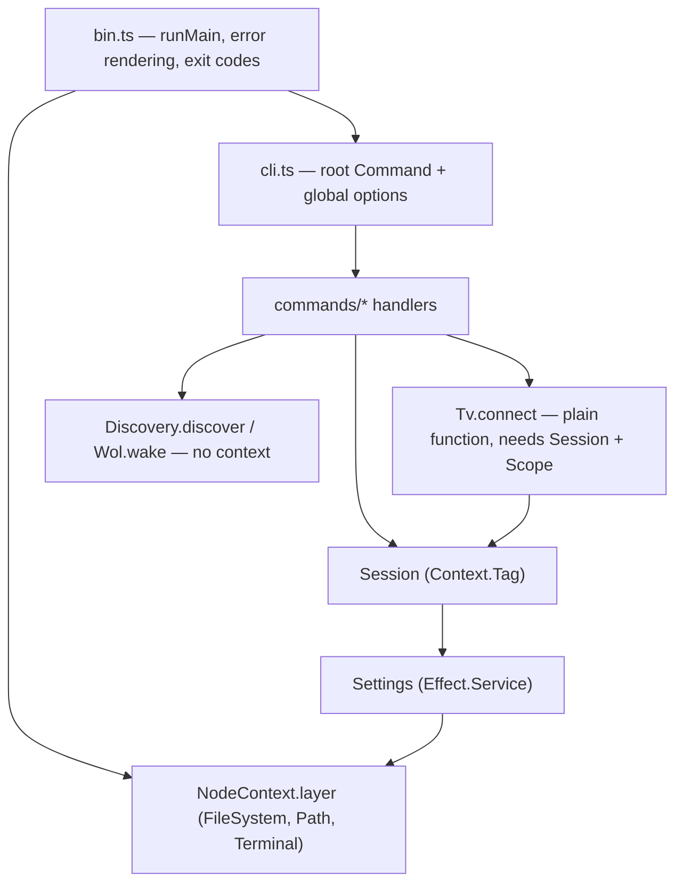

# Architecture

How `lgtv-remote` is put together, for someone about to change it. Usage, flags and
troubleshooting live in [`../README.md`](../README.md) and in `lgtv --help`; the SSAP wire
protocol has its own reference in [`PROTOCOL.md`](./PROTOCOL.md); none of that is repeated here. Node 22+, ESM, `tsc` to `dist/`; `exactOptionalPropertyTypes` and
`noUncheckedIndexedAccess` are on, which is why optional fields are spread conditionally
(`...(x === undefined ? {} : { x })`) rather than assigned `undefined`.

## Layers and dependencies

Only two things are real Effect services: `Settings`, an `Effect.Service`
(`src/services/Settings.ts:28`) needing `FileSystem` + `Path` from `NodeContext`; and `Session`,
a `Context.Tag` whose hand-written layer constructor `Session.layer(options)`
(`src/services/Session.ts:28`, `:34`) closes over the parsed global flags and needs `Settings`.

`Tv`, `Discovery` and `Wol` are **not** services despite living under `src/services/` — they are
plain modules exporting functions that return `Effect`s: `connect`/`withTv`
(`src/services/Tv.ts:191`, `:337`), `discover` (`src/services/Discovery.ts:124`),
`wake`/`parseMac` (`src/services/Wol.ts:47`, `:8`). A `Tv` is a per-connection value, not a
singleton, so there is nothing to put in the context.



Wiring is two `Command.provide` calls on the root command (`src/cli.ts:84-85`):

```ts
Command.provide((options) => Session.layer(options)),
Command.provide(Settings.Default)
```

Two things matter. First, the callback form receives the **root command's parsed options**, and
the layer is provided to the whole subcommand tree — that is how `--host` and friends are
declared once and reach every leaf handler without each subcommand redeclaring them. Second, the
order: `Session.layer` requires `Settings`, so `Settings.Default` has to come after it in the
pipe, where it can satisfy that requirement. Swapping the two lines does not compile.
`NodeContext.layer` is provided last, in `bin.ts:45`, because the top-level error handler runs
under it too.

## Request lifecycle

`lgtv volume set 20`, end to end:

1. `bin.ts:32` calls `run(process.argv)` — `Command.run` (`src/cli.ts:88`). `@effect/cli` parses
   argv into `GlobalOptions` (`src/services/Session.ts:6`) and the two `Command.provide`s
   construct `Settings` then `Session` around the matched handler.
2. The handler calls `withTv` (`src/services/Tv.ts:337`) — `Effect.scoped(connect() >>= use)`.
3. `connect` reads `session.host`, `session.wsUrl`, `session.clientKey`; each is an `Effect`, so
   this is where the config file is actually touched. `openSocket` (`:25`) opens the websocket
   inside `Effect.acquireRelease`, `startPump` (`:64`) attaches the demultiplexer, then the
   handshake runs (below).
4. `request` (`:209`) allocates an id, opens a scoped mailbox, sends the frame, blocks on
   `Queue.take`. The pump routes the reply by id into that mailbox; `interpret` (`:129`) turns it
   into a payload or an `SsapFailed`/`TvUnreachable`. `requestAs` (`:234`) then decodes it with an
   `effect/Schema` from `src/domain/ssap.ts`, mapping decode failures to `UnexpectedResponse`.
5. The command renders through `emit` (`src/ui.ts:20`), which prints the human string or
   `JSON.stringify(data)` depending on `session.json`.
6. Leaving `withTv`'s scope closes the socket. `bin.ts` maps any failure to an exit code.

Per-request timeout is `session.timeout` (`--timeout`, default 10s) and it fails with
`SsapFailed{detail: "no reply within Ns"}` (`src/services/Tv.ts:224`) — not `TvUnreachable`.
`TvUnreachable` means the socket itself failed or closed.

## SSAP

The protocol itself — framing, handshake, the full method catalogue with parameters, and the
pointer channel — is documented in [`PROTOCOL.md`](./PROTOCOL.md), verified against real
hardware. This section covers only how `src/services/Tv.ts` implements it.

`ws://host:3000`, or `wss://host:3001` with `--ssl` (or a device remembered as `ssl: true` —
see *Configuration*). webOS presents a self-signed certificate, so
the client sets `rejectUnauthorized: false` (`src/services/Tv.ts:32`). Everything is JSON text
frames on one socket, multiplexed by `id`.

| Direction | Frame | Notes |
| --- | --- | --- |
| → TV | `{id:"register_0", type:"register", payload:{...manifest, "client-key"?}}` | id is the literal `register_0` (`Tv.ts:261`) |
| ← TV | `{type:"response", id, payload:{pairingType:"PROMPT"}}` | the dialog is now on screen |
| ← TV | `{type:"registered", id, payload:{"client-key":"…"}}` | pairing granted |
| → TV | `{id, type:"request", uri, payload?}` | id is `lgtv-N` from a per-connection counter (`Tv.ts:204`) |
| ← TV | `{type:"response", id, payload}` | success **unless** `payload.returnValue === false` |
| ← TV | `{type:"error", id, error:"…"}` | e.g. `404 no such service or method` |
| → TV | `{id, type:"subscribe", uri}` | the TV then pushes further frames reusing that id |

Two distinct refusal shapes, and both become `SsapFailed`: an `error` frame, and a *successful*
response whose payload carries `returnValue: false` plus `errorText`/`errorCode`
(`src/services/Tv.ts:138-145`). Missing the second one is the classic way to make a failed
command look like it worked.

### Handshake

```mermaid
sequenceDiagram
  participant C as connect
  participant P as pump
  participant TV as webOS TV
  C->>P: mailbox("register_0")
  C->>TV: register + pairingManifest (+ stored client-key)
  alt stored key is still valid
    TV-->>P: registered { client-key }
  else first time
    TV-->>P: response { pairingType: "PROMPT" }
    P-->>C: frame; connect prints "Accept the pairing request on your TV screen…"
    Note over TV: user accepts on screen
    TV-->>P: registered { client-key }
  end
  P-->>C: client-key
  C->>C: session.rememberKey(host, key) if it changed
```

The loop is `awaitKey` at `src/services/Tv.ts:275`. Any `response` frame during the handshake is
read as "the prompt is showing" — it does not inspect `pairingType` — so it prints the notice
once and recurses. `PairingFailed` covers a rejection, a closed socket, and a `registered` frame
with no key. The pairing wait is `Duration.max(session.timeout, 60s)` (`:307`), because a human
has to walk to the TV and a 10s command timeout must not apply. `connect({ announcePairing:
false })` suppresses the notice; `lgtv on --wait` uses it while polling
(`src/commands/power.ts:35`).

`src/domain/pairing.ts` is the manifest every third-party LG remote sends. It carries an RSA
signature block the TV verifies, so it must go over the wire byte-for-byte — do not reformat,
trim permissions, or "clean up" the localized names.

### The pump

`startPump` (`src/services/Tv.ts:64`) owns a `Map<id, Listener>`. Each in-flight request or
subscription gets a scoped `Queue` mailbox (`:117`) registered under its id; releasing the scope
unregisters and shuts the queue down. Frames with no `id`, and frames that fail to decode against
`IncomingFrame` (`src/domain/ssap.ts:57`), are dropped. On `close` or socket `error` the pump
flushes every waiter with a `Closed` delivery (→ `TvUnreachable`) and marks itself closed, so
nothing hangs waiting for a reply that will never come; anyone registering afterwards is failed
immediately (`:90-96`). Subscriptions are exposed as `Stream` via `Stream.unwrapScoped` over the
same mailbox (`:247`), which is what makes `lgtv watch` an ordinary stream fold.

Sharp edge: the message handler calls `JSON.parse` unguarded (`:79`), so a non-JSON text frame
throws inside the `ws` listener rather than being ignored.

### Pointer input channel

`ssap://com.webos.service.networkinput/getPointerInputSocket` returns a `socketPath`; that is a
**second** websocket, opened with the same `openSocket` helper and bound to the same scope
(`src/services/Tv.ts:320`). It does not speak JSON — it takes plain text frames:

```
type:button\nname:HOME\n\n
type:click\n\n
type:move\ndx:40\ndy:-10\ndown:0\n\n
type:scroll\ndx:0\ndy:-3\n\n
```

Remote buttons therefore go over this channel, not over SSAP — `lgtv key` resolves names through
`src/domain/buttons.ts:45` and then calls `pointer.button`. Because the writes are
fire-and-forget, the cursor and key commands sleep ~120ms before the scope closes the socket
(`src/commands/remote.ts:51`), otherwise the last frame can be lost.

### Two things that will bite

`socket.send(data, cb)` in `ws` invokes `cb` with `null` on success, not `undefined` — it passes
the underlying stream callback straight through. Checking `cause === undefined` makes every send
look like a failure. `sendText` checks both (`src/services/Tv.ts:103-114`).

Every socket is acquired with `Effect.acquireRelease`, and both `withTv` and the pointer channel
are `Scope`-bound, so a Ctrl-C during `lgtv watch` or a timeout mid-request still closes the
connection. Anything new that opens a handle belongs in a scope too; there is no other cleanup
path.

## Discovery and wake

Neither is part of the SSAP client and neither needs `Session`. `discover`
(`src/services/Discovery.ts:124`) sends SSDP `M-SEARCH` to 239.255.255.250:1900 for
three targets (`:19`): the LG-specific `urn:lge-com:service:webos-second-screen:1`, plus
`urn:schemas-upnp-org:device:MediaRenderer:1` and `ssdp:all` for models that only advertise as
generic UPnP devices. Replies survive only if `looksLikeLg` (`:48`) matches an LG marker in the
`st`/`usn`/`server`/`location` headers; they are merged per source address, then the UPnP
description at `location` is fetched for `friendlyName`/`modelName` (`:107`) under its own 3s
timeout, degrading to empty rather than failing discovery.

`wake` (`src/services/Wol.ts:47`) builds the magic packet (6×`0xFF` + 16× the MAC) and sends it
to `255.255.255.255` *and* the TV's /24 directed broadcast, on ports 9 and 7, three times each —
which combination gets through depends entirely on the router, and the packets are cheap. It
resolves only once every send has completed, so the socket is not closed early.

The MAC itself is learned at pairing time (`src/commands/setup.ts:53`) and needs *two* calls,
because the connection manager splits what we need across them: `getinfo`
(`src/domain/ssap.ts:55`) carries a `macAddress` per interface but lists every interface whether
or not it has a link, while `getstatus` (`:56`) carries the link state and no MACs. Both are
lowercase on the wire — `getStatus` answers `404 no such service or method`.
`macForActiveInterface` (`:176`) joins them and prefers the connected interface; a naive
"wired first" pick silently stores the dead NIC's MAC on a TV that is on Wi-Fi, and Wake-on-LAN
then fails with nothing to see. `pair` also warns when the TV is on Wi-Fi with
`isWakeOnWifiEnabled: false`, since no magic packet can wake it in that state.

## Configuration

`~/.config/lgtv-remote/config.json`, honouring `$XDG_CONFIG_HOME` and overridable wholesale with
`$LGTV_CONFIG_DIR` (`src/services/Settings.ts:33-39` — the tests rely on that override). Written
with mode `0600` (`:66`) because the client key is a credential. The shape is
`{ defaultHost?, devices?: { [host]: { name?, mac?, clientKey?, ssl? } } }` (`:5-12`) — multi-TV by
design. `rememberDevice` (`:81`) sets `defaultHost` to the first host it stores, so the single-TV
case never needs `config set-host`. Reads are deliberately forgiving — a corrupt or hand-edited
file decodes to `{}` rather than failing (`:58`); only writes report `SettingsUnreadable`.

Host resolution (`src/services/Session.ts:40-49`), in order: `--host` → `$LGTV_HOST` →
`defaultHost` → the single saved device if there is exactly one → `TvNotConfigured`.
**It is lazy** — `SessionApi.host`, `.ssl`, `.wsUrl`, `.clientKey` and `.mac` are `Effect` *fields*, not
values computed while the layer is built. That is the load-bearing design point:
the layer is provided to the entire command tree, so eager resolution would make `lgtv discover`,
`lgtv config show` and `lgtv --help` fail with `TvNotConfigured` on a fresh install — before the
user has any way to configure a host. Lazily, only commands that actually need a TV pay for it,
and anything reading `session.host` inherits `TvNotConfigured | SettingsUnreadable` in its error
channel — the type system marks which commands need configuration.

Transport resolution (`sslFor`, `src/services/Session.ts:66-76`), in order: `--ssl`/`--no-ssl` →
`$LGTV_SSL` → the saved `devices[host].ssl` → plain. It is per-device because pairing itself is:
a key granted over `wss://` is not honoured on the plain port, so the transport has to be
remembered alongside the key or the next command re-prompts. Both writers store it — `pair`
(`src/commands/setup.ts:87`) and `SessionApi.rememberKey` (`Session.ts:100`), which covers a first
connect made by any other command. Because the value is written on every pairing, re-pairing
without the flag clears it; `config set-ssl on|off` changes it without re-pairing.

`--ssl` is therefore *three*-state at the CLI boundary (`src/cli.ts:31-48`): a plain
`Options.boolean` cannot distinguish "off" from "unset", so `--ssl` and `--no-ssl` are two
booleans mapped to one `Option<boolean>`, where `none` means "ask the saved device".

Other environment inputs: `LGTV_PORT` (ignored unless a positive integer), `LGTV_SSL` (any
non-empty value enables SSL; the value is not parsed, so `LGTV_SSL=0` still turns it on, and it
outranks a device saved as `ssl: false`), and `LGTV_MAC`, checked *before* the stored per-device
MAC (`:90-98`). There is no `--mac` flag.

## Errors and exit codes

Every failure is a `Data.TaggedError` in `src/domain/errors.ts`: `TvUnreachable`,
`PairingFailed`, `NotPaired`, `SsapFailed`, `UnexpectedResponse`, `TvNotConfigured`,
`SettingsUnreadable`, `DiscoveryFailed`, `WakeFailed`, `BadInput`. Rendering is `explain()`
(`src/domain/errors.ts:73`) — a one-liner plus, where it helps, the next thing to try. (The file
header comment claims rendering lives in `ui.ts`; it does not, and `ui.ts` never imports it.)
`NotPaired` is declared and rendered but never constructed anywhere: `connect` always sends the
register frame, so a missing key just means the TV shows the prompt. Wire it up or delete it.

`bin.ts` catches by tag against a `knownTags` set (`src/bin.ts:7-24`) rather than by class, so
**adding an error type means editing both files**. In `--json` mode it prints
`{error, message, detail}`, otherwise a red `✗` line; both go to stderr, so `--json` stdout stays
pipeable. That flag is read straight off `process.argv` (`bin.ts:28`), not from `Session` — the
layer only exists once parsing succeeded, and parse failures still have to render.

| Exit | When |
| --- | --- |
| 0 | success |
| 1 | any known `LgTvError`, or any other failure/defect (`bin.ts:56`) |
| 130 | the cause is interruption only, i.e. Ctrl-C (`bin.ts:52`) |

## Tests

`npm test` runs `node:test` through `tsx`. No framework, and nothing in `src/` is mocked.
`test/fake-tv.ts` is a real `ws` server on port 0 implementing enough webOS to exercise the
client: the prompt-then-grant handshake, keyed re-connection without a prompt, a handful of
`ssap://` endpoints, *both* refusal shapes (an `error` frame for unknown URIs, `returnValue:
false` for `ssap://tv/openChannel`), a second server standing in for the pointer input socket,
and `pushVolume` to emit subscription updates on a remembered id.

`test/protocol.test.ts` drives the real `connect`/`withTv` against it, building `Session.layer`
from a literal `GlobalOptions` (`protocol.test.ts:17-24`) — the same layer the CLI builds, so the
service graph is under test too, minus argv parsing. `LGTV_CONFIG_DIR` points at a `mkdtemp`
directory so the suite never touches the developer's real config. Unreachable-host behaviour is
covered by pointing a second layer at port 1.

`test/units.test.ts` covers the two pure helpers worth isolating, `parseMac` and `resolveButton`.
Not covered: SSDP and Wake-on-LAN (both need real broadcast traffic), and the command handlers.

## Why the protocol is hand-rolled

Summarised in the [README](../README.md#why-not-the-lgtv2-package): `lgtv2` is callback-based,
untyped and unmaintained since 2022. Structurally, the direct implementation buys schema-decoded
responses, typed errors in the error channel, scope-bound sockets and subscriptions as real
`Stream`s — none of which can be retrofitted onto an `EventEmitter` API without wrapping every
call anyway.
