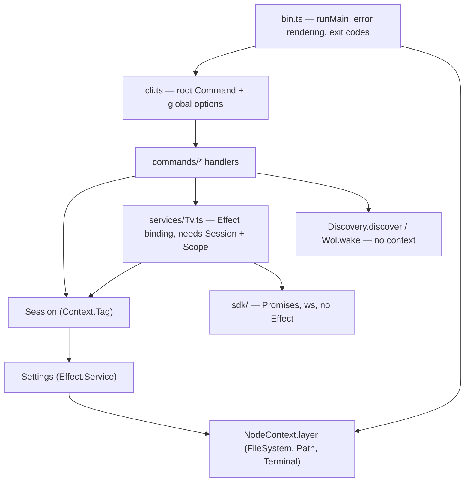

# Architecture

How `lgtv-remote` is put together, for someone about to change it. Usage, flags and
troubleshooting live in [`../README.md`](../README.md) and in `lgtv --help`; the SSAP wire
protocol has its own reference in [`PROTOCOL.md`](./PROTOCOL.md); none of that is repeated here. Node 22+, ESM, `tsc` to `dist/`; `exactOptionalPropertyTypes` and
`noUncheckedIndexedAccess` are on, which is why optional fields are spread conditionally
(`...(x === undefined ? {} : { x })`) rather than assigned `undefined`.

## Layers and dependencies

The protocol client is not part of this graph at all. `src/sdk/` is an ordinary Promise-based
SDK with `ws` as its only dependency — see *The SSAP client* below — and `src/services/Tv.ts` is the
Effect binding over it. Everything described here sits above that line.

Only two things are real Effect services: `Settings`, an `Effect.Service`
(`src/services/Settings.ts:32`) needing `FileSystem` + `Path` from `NodeContext`; and `Session`,
a `Context.Tag` whose hand-written layer constructor `Session.layer(options)`
(`src/services/Session.ts:28`, `:34`) closes over the parsed global flags and needs `Settings`.

`Tv`, `Discovery`, `Wol`, `Link` and `LineReader` are **not** services despite living under
`src/services/` — they are plain modules exporting functions that return `Effect`s: `connect`/
`withTv` (`src/services/Tv.ts:117`, `:229`), `discover` (`src/services/Discovery.ts:124`),
`wake`/`parseMac` (`src/services/Wol.ts:47`, `:8`), `Link.make` and `LineReader.makeLineReader`
(used only by `lgtv repl`, below). A `Tv` is a per-connection value, not a singleton, so there is
nothing to put in the context; `Link` and `LineReader` are one-per-repl-session values for the
same reason, and passing them as plain values is what lets tests hand `repl.ts` a stub `LineReader`
without standing up a layer.



Wiring is two `Command.provide` calls on the root command (`src/cli.ts:68-69`):

```ts
Command.provide((options) => Session.layer(options)),
Command.provide(Settings.Default)
```

Two things matter. First, the callback form receives the **root command's parsed options**, and
the layer is provided to the whole subcommand tree — that is how `--host` and friends are
declared once and reach every leaf handler without each subcommand redeclaring them. Second, the
order: `Session.layer` requires `Settings`, so `Settings.Default` has to come after it in the
pipe, where it can satisfy that requirement. Swapping the two lines does not compile.
`NodeContext.layer` is provided last, in `bin.ts:22`, because the top-level error handler runs
under it too.

## Request lifecycle

`lgtv volume set 20`, end to end:

1. `bin.ts:13` calls `run(process.argv)` — `Command.run` (`src/cli.ts:72`). `@effect/cli` parses
   argv into `GlobalOptions` (`src/services/Session.ts:6`) and the two `Command.provide`s
   construct `Settings` then `Session` around the matched handler.
2. The handler calls `withTv` (`src/services/Tv.ts:229`) — `Effect.scoped(connect() >>= use)`, unless
   `lgtv repl` has already dialled and left a connection in the `CurrentTv` context (below), in
   which case `withTv` reuses it instead. A command never dials when a connection is already in
   scope — that invariant is what lets 22 hand-written handlers share one socket without any of
   them knowing the repl exists.
3. `connect` (`src/services/Tv.ts:117`) reads `session.host`, `session.wsUrl`,
   `session.clientKey`; each is an `Effect`, so this is where the config file is actually
   touched. It then hands those to the SDK's own `connect` (`src/sdk/client.ts:274`), which
   opens the socket, attaches the demultiplexer and runs the handshake, and registers a
   finalizer that closes the connection when the scope ends.
4. `tv.request` wraps `connection.request` (`src/sdk/client.ts:338`): the SDK allocates an id,
   registers a mailbox with the pump, sends the frame and waits. `interpret`
   (`src/sdk/client.ts:154`) turns the reply into a payload or throws `SsapFailed`/
   `TvUnreachable`; the binding's `call` (`src/services/Tv.ts:48`) moves that into the error
   channel. `requestAs` runs the payload through a decoder from `src/sdk/responses.ts`, mapping
   a mismatch to `UnexpectedResponse`.
5. The command renders through `emit` (`src/ui.ts:20`), which prints the human string or
   `JSON.stringify(data)` depending on `session.json`.
6. Leaving `withTv`'s scope closes the socket. `bin.ts` maps any failure to an exit code.

Per-request timeout is `session.timeout` (`--timeout`, default 10s), enforced inside the SDK,
and it fails with `SsapFailed{detail: "no reply within Ns"}` (`src/sdk/client.ts:303`) — not
`TvUnreachable`. `TvUnreachable` means the socket itself failed or closed.

## The SSAP client

The protocol itself — framing, handshake, the full method catalogue with parameters, and the
pointer channel — is documented in [`PROTOCOL.md`](./PROTOCOL.md), verified against real
hardware. This section covers how it is implemented, which is in two pieces:

| | |
| --- | --- |
| `src/sdk/` | The client. Promises, `ws`, and nothing else — no `effect` import anywhere under it, enforced by `test/sdk.test.ts`. Published as `lgtv-remote/sdk`. |
| `src/services/Tv.ts` | The Effect binding: failures as typed values, sockets on a `Scope`, subscriptions as `Stream`s, the client key read through `Session`. |

The split exists because none of what the CLI needs from Effect is *protocol*. Anyone wanting
to drive a TV from an ordinary Node program should not have to adopt a runtime to do it, and
keeping the boundary honest also keeps the protocol code testable without a service graph
(`test/contract/`, below). The CLI is simply the SDK's first consumer.

`ws://host:3000`, or `wss://host:3001` with `--ssl` (or a device remembered as `ssl: true` —
see *Configuration*). webOS presents a self-signed certificate, so
the client sets `rejectUnauthorized: false` (`src/sdk/client.ts:64`). Everything is JSON text
frames on one socket, multiplexed by `id`.

| Direction | Frame | Notes |
| --- | --- | --- |
| → TV | `{id:"register_0", type:"register", payload:{...manifest, "client-key"?}}` | id is the literal `register_0` (`client.ts:510`) |
| ← TV | `{type:"response", id, payload:{pairingType:"PROMPT"}}` | the dialog is now on screen |
| ← TV | `{type:"registered", id, payload:{"client-key":"…"}}` | pairing granted |
| → TV | `{id, type:"request", uri, payload?}` | id is `lgtv-N` from a per-connection counter (`client.ts:289`) |
| ← TV | `{type:"response", id, payload}` | success **unless** `payload.returnValue === false` |
| ← TV | `{type:"error", id, error:"…"}` | e.g. `404 no such service or method` |
| → TV | `{id, type:"subscribe", uri}` | the TV then pushes further frames reusing that id |

Two distinct refusal shapes, and both become `SsapFailed`: an `error` frame, and a *successful*
response whose payload carries `returnValue: false` plus `errorText`/`errorCode`
(`src/sdk/client.ts:154-166`). Missing the second one is the classic way to make a failed
command look like it worked.

### Handshake

```mermaid
sequenceDiagram
  participant C as connect
  participant P as pump
  participant TV as webOS TV
  C->>P: mailbox("register_0")
  C->>TV: register + pairingManifest (+ stored client-key)
  alt stored key is still valid
    TV-->>P: registered { client-key }
  else first time
    TV-->>P: response { pairingType: "PROMPT" }
    P-->>C: frame; connect calls onPairingPrompt once
    Note over TV: user accepts on screen
    TV-->>P: registered { client-key }
  end
  P-->>C: client-key
  C->>C: keyChanged = key !== the one offered
```

The listener is registered at `src/sdk/client.ts:512`, before the register frame goes out. Any
frame that is neither `registered` nor `error` is read as "the prompt is showing" — it does not
inspect `pairingType`, which has moved across firmware versions — so it fires `onPairingPrompt`
once and keeps waiting. `PairingFailed` covers a rejection, a closed socket, a `registered`
frame with no key, and the approval timeout. That timeout is never below 60s
(`MIN_PAIRING_TIMEOUT_MS`, `client.ts:44`), because a human has to walk to the TV and a 10s
command timeout must not apply.

`keyChanged` is how a granted key gets stored without the SDK knowing what storage is: the
binding writes it through `session.rememberKey`, and a standalone caller gets the same signal
as the `onClientKey` callback. Either way it is silent when the TV hands back the key it was
given, so a re-connection does not rewrite the config file on every command.

`src/sdk/pairing.ts` is the manifest every third-party LG remote sends. It carries an RSA
signature block the TV verifies, so it must go over the wire byte-for-byte — do not reformat,
trim permissions, or "clean up" the localized names.

### The pump

`startPump` (`src/sdk/client.ts:111`) owns a `Map<id, Listener>`. Each in-flight request or
subscription registers under its id and unregisters however it ends — reply, timeout, abort, or
the caller closing the subscription. Frames that are not JSON, frames that do not look like
frames, and frames with no `id` are dropped inside the `ws` listener, where a throw would be an
uncaught exception rather than a failed call. On `close` or socket `error` the pump flushes
every waiter with a `Closed` delivery (→ `TvUnreachable`) and marks itself closed, so nothing
hangs waiting for a reply that will never come; anyone registering afterwards is failed
immediately (`client.ts:142-148`). A failed *write* takes the same path (`client.ts:296`): a
send that fails means the socket is broken, which is everyone's problem and not just that
frame's.

### Pointer input channel

`ssap://com.webos.service.networkinput/getPointerInputSocket` returns a `socketPath`; that is a
**second** websocket, opened by the same helper and owned by the connection
(`src/sdk/client.ts:460`). It does not speak JSON — it takes plain text frames:

```
type:button\nname:HOME\n\n
type:click\n\n
type:move\ndx:40\ndy:-10\ndown:0\n\n
type:scroll\ndx:0\ndy:-3\n\n
```

Remote buttons therefore go over this channel, not over SSAP — `lgtv key` resolves names through
`src/domain/buttons.ts:45` and then calls `pointer.button`. Because the writes are
fire-and-forget, the cursor and key commands sleep ~120ms before the scope closes the socket
(`src/commands/remote.ts:51`), otherwise the last frame can be lost.

The channel is opened lazily and memoised on the connection, so `key` and `cursor` share one
socket rather than reopening it every press. It is memoised **on success only**
(`client.ts:483`): caching the rejection instead would make one transient refusal permanent for
the life of the connection. The forgetting is done by a separate `.catch` rather than by
rethrowing into the stored promise, so an abandoned attempt — an interrupted `key` press — still
counts as handled and does not surface as an unhandled rejection.

### Decoding without a schema library

`src/sdk/decode.ts` is a decoder combinator in ~140 lines: `string`, `number`, `boolean`,
`array`, `record`, `optional`, `struct`. A `Decoder<A>` is a single method returning
`{ok: true, value}` or `{ok: false, reason}`, which is small enough that a caller who already
has zod or `effect/Schema` can plug theirs in instead. `src/sdk/responses.ts` uses it to state
every reply shape worth narrowing, exporting each as a value *and* a type of the same name so
`requestAs(Uri.getVolume, VolumeStatus)` reads as the type it returns.

Two decisions worth knowing. Structs **ignore fields they do not mention**: SSAP payloads carry
firmware- and model-specific extras, and rejecting a reply for saying more than we asked about
would break on the next TV. And an absent optional field stays absent rather than being
materialised as `undefined` — the CLI compiles with `exactOptionalPropertyTypes`, and an
explicit `null` (which a couple of endpoints send) is read the same way as absent.

### The Effect binding

`src/services/Tv.ts` is what is left once the protocol moves out, and it is nearly all
translation:

- **Failures.** The SDK rejects with `TvUnreachable`, `PairingFailed`, `SsapFailed` or
  `UnexpectedResponse`; `toDomainError` (`:29`) maps each onto the identically-tagged
  `Data.TaggedError` in `src/domain/errors.ts`, and `call` (`:48`) puts it in the error channel.
  Anything that is *not* an `SsapError` dies instead of being mapped — a `TypeError` from a bug
  must not reach the user dressed as a TV problem. `catchTags` then narrows per method
  (`:165`): a `request` cannot fail the handshake and decodes nothing, so `PairingFailed` and
  `UnexpectedResponse` are defects there, and saying so keeps them out of the error type of all
  22 command handlers.
- **Interruption.** `connect` is wrapped in `Effect.uninterruptibleMask` rather than
  `Effect.acquireRelease` (`:134`). `acquireRelease` makes acquisition uninterruptible, and
  acquisition here includes a pairing wait that can last a minute — Ctrl-C has to work during
  it. The mask keeps the dial itself interruptible (the SDK takes an `AbortSignal` and closes
  what it opened) while still guaranteeing the finalizer is registered for a connection that did
  open. Per-request interruption works the same way: `Effect.tryPromise` hands its signal
  straight to `connection.request`.
- **Streams.** `subscribe` is `Stream.asyncPush` over the SDK's callback subscription
  (`:169`), with the unsubscribe as the release step — which is what makes `lgtv watch` an
  ordinary stream fold, and what stops a finished `Stream.take` from leaving a listener behind.
- **`decodeRequest`** (`:94`) expresses `requestAs` in terms of whatever `request` it is given,
  so anything decorating `request` — `lgtv repl`'s reply echo — covers the decoded calls too
  instead of silently missing every `requestAs`.

### Two things that will bite

`socket.send(data, cb)` in `ws` invokes `cb` with `null` on success, not `undefined` — it passes
the underlying stream callback straight through. Checking `cause === undefined` makes every send
look like a failure. `sendText` checks both (`src/sdk/client.ts:100-108`).

On the Effect side every connection is registered with a finalizer and both `withTv` and the
repl's `Link` are `Scope`-bound, so a Ctrl-C during `lgtv watch` or a timeout mid-request still
closes the socket. Anything new that opens a handle belongs in a scope too; there is no other
cleanup path. Inside the SDK the equivalent rule is that every socket goes into the connection's
`sockets` set, and `close()` is the only thing that takes them down.

## `lgtv repl`

Every other command opens its own websocket, runs the handshake, sends one or two frames, and
closes — `withTv` is `Effect.scoped(connect() >>= use)`. `lgtv repl` (`src/commands/repl.ts`)
instead holds one connection open across a whole interactive session, by reusing the *same*
`@effect/cli` command tree the top-level CLI uses rather than hand-rolling a second parser:

- **`src/commands/index.ts`** holds the `subcommands` tuple both `cli.ts` and `repl.ts` build
  from, so the two can never drift and so `repl` can exclude itself — typing `repl` at the prompt
  is just an unknown argument, not recursion. `repl.ts` builds its own root command from that
  tuple and calls `Command.run` on it a second time, once per line; the inner root carries no
  `Command.provide`, so it dispatches into whatever `Session`/`Settings` the *outer* `cli.ts` root
  already put in scope, inheriting `--host`/`--ssl`/`--timeout`/`--json` for the session.
- **`CurrentTv`** (`src/services/Tv.ts`) is a `Context.Tag` holding an already-open `Tv`. `withTv`
  checks it first and reuses the connection if present, dialling as before otherwise — see
  *Request lifecycle* above. This is the entire seam: none of the 22 command handlers know the
  repl exists.
- **`src/services/Link.ts`** owns the one live connection, replacing it on demand rather than
  holding it for the process lifetime. Death is detected twice, because neither signal alone is
  enough: *pre-flight* via `Tv["closed"]` (an additive field exposing what the pump already
  tracks) before reusing a connection — catching the case where the TV went to standby between
  lines — and *post-flight* by resetting the link whenever a dispatched line fails with
  `TvUnreachable`. Neither path retries the line itself: "the socket was already dead" and "the
  frame reached the TV and then the socket died" are indistinguishable, so a silent resend of
  `key POWER` would be worse than a visible error. `Link` used to memoise the Magic Remote
  pointer socket per generation as well; it no longer does, because the SDK memoises the channel
  on the connection itself (*Pointer input channel* above) — which is where it always belonged,
  since "one pointer socket per connection" is true of any caller and not just the repl.
- **`src/services/LineReader.ts`** wraps `node:readline`, chosen over `@effect/platform`
  `Terminal.readLine` and `@effect/cli` `Prompt.text` because it is the only one that gives
  history, tab completion, a `SIGINT` event, echo, and non-TTY piped stdin from one API. Its
  `'line'` listener is persistent — registered once, independent of whether anything is currently
  waiting — because Node drops a line with no listener attached, which a question-per-line loop
  would do to every line after the first in a piped chunk. Each command runs in the foreground via
  `Fiber.await`/`Fiber.interrupt`, so Ctrl-C cancels the running command and hands control back to
  the prompt rather than ending the session.
- **`src/domain/tokenize.ts`** splits one line into argv-style tokens (quotes, escapes), matching
  `parseMac`'s convention of returning failure as data.
- **Reply echo**, off unless `VERBOSE` is set (`true`/`1`/`yes`/`on`, read once at import like
  `NO_COLOR`, since nothing in a session can change how the process was started). When on, the
  `Tv` handed to `CurrentTv` for one line is wrapped by `echoing`
  (`src/commands/repl.ts`), which taps `request` and prints each payload to stderr as it arrives,
  plus a `← no response` flag when a *successful* line produced none — a failed line has already
  said what happened. So that the wrapper cannot miss the decoded calls, `requestAs` is not
  written out inside `connect` but derived from whatever `request` it is given, via the
  exported `decodeRequest` (`src/services/Tv.ts:94`); wrapping `request` therefore covers both.
  Subscriptions are marked heard but not echoed (`watch` prints every update itself), and
  `pointer` is left undecorated — it resolves inside the SDK, off the connection's own memoised
  channel — so the one-off `getPointerInputSocket` exchange stays out of the echo and key/cursor
  lines, write-only on the input socket, get the flag.

Two things worth knowing if you extend this:

- Global flags are not parseable per line — `lgtv> --json status` fails, because the inner
  `Command.run` has no `Command.provide` of its own to re-resolve `Session` from a parsed
  `--json`. Only `lgtv --json repl` (set for the whole session) works today.
- Subscriptions are never cancelled TV-side. `lgtv watch` run more than once in a session leaves
  each earlier subscription pushing frames the pump then drops (no listener is registered for
  that id) — not a leak on our side, since the mailbox unregisters normally, but the TV keeps
  pushing until the socket closes. A real fix needs an `unsubscribe` frame.

## Discovery and wake

Neither is part of the SSAP client and neither needs `Session`. `discover`
(`src/services/Discovery.ts:124`) sends SSDP `M-SEARCH` to 239.255.255.250:1900 for
three targets (`:19`): the LG-specific `urn:lge-com:service:webos-second-screen:1`, plus
`urn:schemas-upnp-org:device:MediaRenderer:1` and `ssdp:all` for models that only advertise as
generic UPnP devices. Replies survive only if `looksLikeLg` (`:48`) matches an LG marker in the
`st`/`usn`/`server`/`location` headers; they are merged per source address, then the UPnP
description at `location` is fetched for `friendlyName`/`modelName` (`:107`) under its own 3s
timeout, degrading to empty rather than failing discovery.

`wake` (`src/services/Wol.ts:47`) builds the magic packet (6×`0xFF` + 16× the MAC) and sends it
to `255.255.255.255` *and* the TV's /24 directed broadcast, on ports 9 and 7, three times each —
which combination gets through depends entirely on the router, and the packets are cheap. It
resolves only once every send has completed, so the socket is not closed early.

The MAC itself is learned at pairing time (`src/commands/setup.ts:53`) and needs *two* calls,
because the connection manager splits what we need across them: `getinfo`
(`src/sdk/uri.ts:55`) carries a `macAddress` per interface but lists every interface whether
or not it has a link, while `getstatus` (`:56`) carries the link state and no MACs. Both are
lowercase on the wire — `getStatus` answers `404 no such service or method`.
`macForActiveInterface` (`src/sdk/responses.ts:134`) joins them and prefers the connected
interface; a naive
"wired first" pick silently stores the dead NIC's MAC on a TV that is on Wi-Fi, and Wake-on-LAN
then fails with nothing to see. `pair` also warns when the TV is on Wi-Fi with
`isWakeOnWifiEnabled: false`, since no magic packet can wake it in that state.

## Configuration

`~/.config/lgtv-remote/config.yaml`, honouring `$XDG_CONFIG_HOME` and overridable wholesale with
`$LGTV_CONFIG_DIR` (`src/services/Settings.ts:37-43` — the tests rely on that override). Written
with mode `0600` (`:70`) because the client key is a credential. The shape is
`{ defaultHost?, devices?: { [host]: { name?, mac?, clientKey?, ssl? } } }` (`:6-13`) — multi-TV by
design. `rememberDevice` (`:82`) sets `defaultHost` to the first host it stores, so the single-TV
case never needs `config set-host`. Reads are deliberately forgiving — a corrupt or hand-edited
file decodes to `{}` rather than failing (`:62`); only writes report `SettingsUnreadable`.
The file was JSON until the format changed; there is no fallback to the old path, so a
`config.json` left in place is ignored.

Host resolution (`src/services/Session.ts:40-49`), in order: `--host` → `$LGTV_HOST` →
`defaultHost` → the single saved device if there is exactly one → `TvNotConfigured`.
**It is lazy** — `SessionApi.host`, `.ssl`, `.wsUrl`, `.clientKey` and `.mac` are `Effect` *fields*, not
values computed while the layer is built. That is the load-bearing design point:
the layer is provided to the entire command tree, so eager resolution would make `lgtv discover`,
`lgtv config show` and `lgtv --help` fail with `TvNotConfigured` on a fresh install — before the
user has any way to configure a host. Lazily, only commands that actually need a TV pay for it,
and anything reading `session.host` inherits `TvNotConfigured | SettingsUnreadable` in its error
channel — the type system marks which commands need configuration.

Transport resolution (`sslFor`, `src/services/Session.ts:66-76`), in order: `--ssl`/`--no-ssl` →
`$LGTV_SSL` → the saved `devices[host].ssl` → plain. It is per-device because pairing itself is:
a key granted over `wss://` is not honoured on the plain port, so the transport has to be
remembered alongside the key or the next command re-prompts. Both writers store it — `pair`
(`src/commands/setup.ts:87`) and `SessionApi.rememberKey` (`Session.ts:100`), which covers a first
connect made by any other command. Because the value is written on every pairing, re-pairing
without the flag clears it; `config set-ssl on|off` changes it without re-pairing.

`--ssl` is therefore *three*-state at the CLI boundary (`src/cli.ts:24-37`): a plain
`Options.boolean` cannot distinguish "off" from "unset", so `--ssl` and `--no-ssl` are two
booleans mapped to one `Option<boolean>`, where `none` means "ask the saved device".

Other environment inputs: `LGTV_PORT` (ignored unless a positive integer), `LGTV_SSL` (any
non-empty value enables SSL; the value is not parsed, so `LGTV_SSL=0` still turns it on, and it
outranks a device saved as `ssl: false`), and `LGTV_MAC`, checked *before* the stored per-device
MAC (`:90-98`). There is no `--mac` flag.

## Errors and exit codes

Every failure is a `Data.TaggedError` in `src/domain/errors.ts`: `TvUnreachable`,
`PairingFailed`, `NotPaired`, `SsapFailed`, `UnexpectedResponse`, `TvNotConfigured`,
`SettingsUnreadable`, `DiscoveryFailed`, `WakeFailed`, `BadInput`. Rendering is `explain()`
(`src/domain/errors.ts:73`) — a one-liner plus, where it helps, the next thing to try. (The file
header comment claims rendering lives in `ui.ts`; it does not, and `ui.ts` never imports it.)
`NotPaired` is declared and rendered but never constructed anywhere: `connect` always sends the
register frame, so a missing key just means the TV shows the prompt. Wire it up or delete it.

Four of those tags are duplicated on purpose. `src/sdk/errors.ts` declares `TvUnreachable`,
`PairingFailed`, `SsapFailed` and `UnexpectedResponse` as plain `Error` subclasses with the
same `_tag`s and the same fields, because an SDK that made its callers install `effect` to read
a failure would not be standalone. `toDomainError` (`src/services/Tv.ts:29`) is the one place
they are translated, and matching the names is what keeps it a `switch` with no thinking in it.

`bin.ts` and `repl.ts` both classify failures with `isLgTvError` and render them with `render`
(`src/domain/errors.ts`), which checks tags against a `satisfies Record<LgTvError["_tag"], true>`
map — so forgetting to list a new error there is a compile error, not a silent gap the way a
hand-kept `Set` in two files would be. In `--json` mode it prints `{error, message, detail}`,
otherwise a red `✗` line; both go to stderr, so `--json` stdout stays pipeable. In `bin.ts` that
flag is read straight off `process.argv` (`bin.ts:9`), not from `Session` — the layer only exists
once parsing succeeded, and parse failures still have to render. `repl.ts` reads it from `Session`
directly, since by the time a line is dispatched the layer is already built.

| Exit | When |
| --- | --- |
| 0 | success |
| 1 | any known `LgTvError`, or any other failure/defect (`bin.ts:33`) |
| 130 | the cause is interruption only, i.e. Ctrl-C (`bin.ts:29`) |

## Tests

`npm test` runs `node:test` through `tsx`. No framework, and nothing in `src/` is mocked.
`npm run typecheck` uses `test/tsconfig.json`, which is the root config widened to include
`test/` — the root `tsconfig.json` builds `src/` only, so on its own it never checks the tests.
That same config is what ESLint's type-aware rules resolve the tests against.

`test/fake-tv.ts` is a real `ws` server on port 0 implementing enough webOS to exercise the
client, and it is deliberately adversarial: alongside the prompt-then-grant handshake, keyed
re-connection, a handful of `ssap://` endpoints and *both* refusal shapes, it can reject a
pairing, return `registered` with no key, never answer at all, go silent on a chosen uri
(`silence`), answer late so replies arrive out of order (`delayReply`), terminate connections
mid-request (`dropConnections`), and push four flavours of junk down a subscription. It also
counts open sockets and prompts, and records every frame verbatim in `rawFrames`.

### The contract suite

`test/contract/` is the harness that had to survive detaching the protocol client from Effect,
and now holds the two implementations to one description of it.
`client.ts` defines a plain Promise-shaped seam — no `effect` import anywhere in it — and
`suite.ts` states the client's behaviour against that seam only: handshake outcomes, refusal
shapes, request timeout, dropped sockets, out-of-order demultiplexing, decode failures,
subscription lifetime, pointer frames, and socket teardown. Two adapters implement it:
`plain-client.ts` for `src/sdk` on its own, and `effect-client.ts` for the binding, handing
`connect` a literal `SessionApi` — no `Settings`, no filesystem — because where the client key
is *stored* is the CLI's concern, not the protocol's. `test/contract.test.ts` runs the suite
and the wire transcript against both.

Neither `suite.ts` nor `wire.ts` was edited while the SDK was extracted, which was the point of
writing them that way: a case that had needed changing would have meant the port changed
behaviour rather than structure. Keep it that way — a behaviour only one implementation has does
not belong in `suite.ts`, and if the Effect binding is ever retired, deleting
`effect-client.ts` is the whole job.

`test/contract/wire.ts` is a golden transcript — exact frame shapes, the per-connection `lgtv-N`
counter, and a **frozen sha256 of the serialised pairing manifest**. The behavioural tests cannot
catch a mangled manifest (the fake TV ignores its contents, and comparing the wire against
`pairingManifest` moves both sides together), but a real TV verifies an RSA signature over those
exact bytes. Changing the checksum means you have a new signature and have tested it on hardware.

`test/protocol.test.ts` drives the real `connect`/`withTv` through the actual `Session.layer` and
`Settings` (`LGTV_CONFIG_DIR` points at a `mkdtemp` directory), which is what keeps the *service
graph* under test — the contract suite deliberately bypasses it. Transport resolution lives here
for the same reason.

`test/sdk.test.ts` covers what only the SDK has. Its *protocol* behaviour is not there — that is
the contract suite — but three things are: the independence itself (no file under `src/sdk`
imports `effect`, reaches into the rest of the repo, or depends on anything but `ws`, checked by
reading the sources), the decoders including the exact text of a failure path, and subscriptions
as an async iterable, which has no Effect counterpart to compare against and so cannot be stated
through the contract seam.

`test/units.test.ts` covers the pure helpers worth isolating: `parseMac`, `macForActiveInterface`,
`resolveButton`, the YouTube link parsing, and `tokenize`.

`test/repl.test.ts` drives `runRepl` (`src/commands/repl.ts`) against the fake TV with a stubbed
`LineReader` — a queue the test offers lines to directly, so nothing touches real `stdin`. It
covers one connection/one handshake across many lines, one pointer socket across several
`key`/`cursor` lines, both the pre-flight (idle) and post-flight (mid-command) reconnect paths,
bad input and `exit` never opening or re-handshaking a connection, and a baseline showing plain
`withTv` opening one connection per call for contrast. `LineReader` itself is tested separately
against a `PassThrough`, writing several lines in one `write()` to catch the typeahead-drop
regression a `rl.question`-based loop would have. Five end-to-end cases spawn `bin.ts` for real,
piping a script over non-TTY stdin: one proves the process actually exits 0 (the only tier that
exercises the `input.pause()` finalizer), and four cover the reply echo — that it stays silent
without `VERBOSE`, that payloads then land on stderr and not on stdout, that a `key` line gets
`← no response`, and that a failed line does not. Spawning is what keeps the two streams
genuinely apart and lets a test set `VERBOSE` for one case only, neither of which an in-process
test can do (the flag is read at import).

Not covered: `wss://` (needs a TLS fake TV with a fixture certificate), the pairing-approval
timeout (the wait is `max(timeout, 60s)`, so a real test would take a minute — the 60s floor is
covered indirectly by pairing succeeding past a short request timeout), SSDP and Wake-on-LAN
(both need real broadcast traffic), and most command handlers in isolation — `test/repl.test.ts`
exercises several of them end to end through dispatch, but not each one's own edge cases.

## Why the protocol is hand-rolled

Summarised in the [README](../README.md#why-not-the-lgtv2-package): `lgtv2` is callback-based,
untyped and unmaintained since 2022. Structurally, the direct implementation buys decoded
responses, typed failures, one properly demultiplexed socket and subscriptions you can iterate —
none of which can be retrofitted onto an `EventEmitter` API without wrapping every call anyway.
The Effect binding then adds scope-bound sockets, real `Stream`s and errors in the error channel
on top, without any of that reaching the wire.
